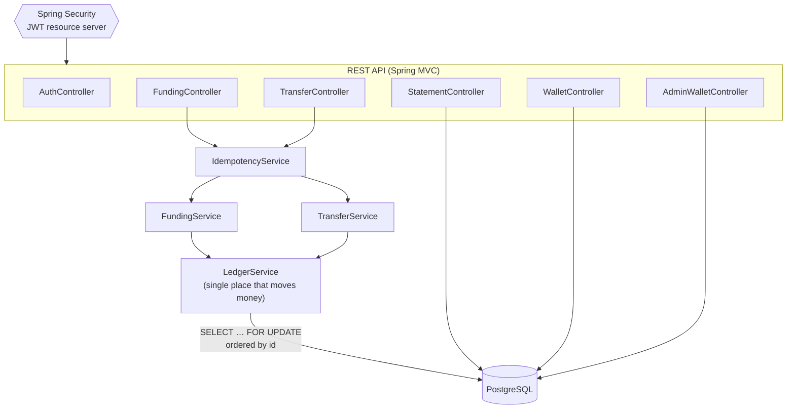
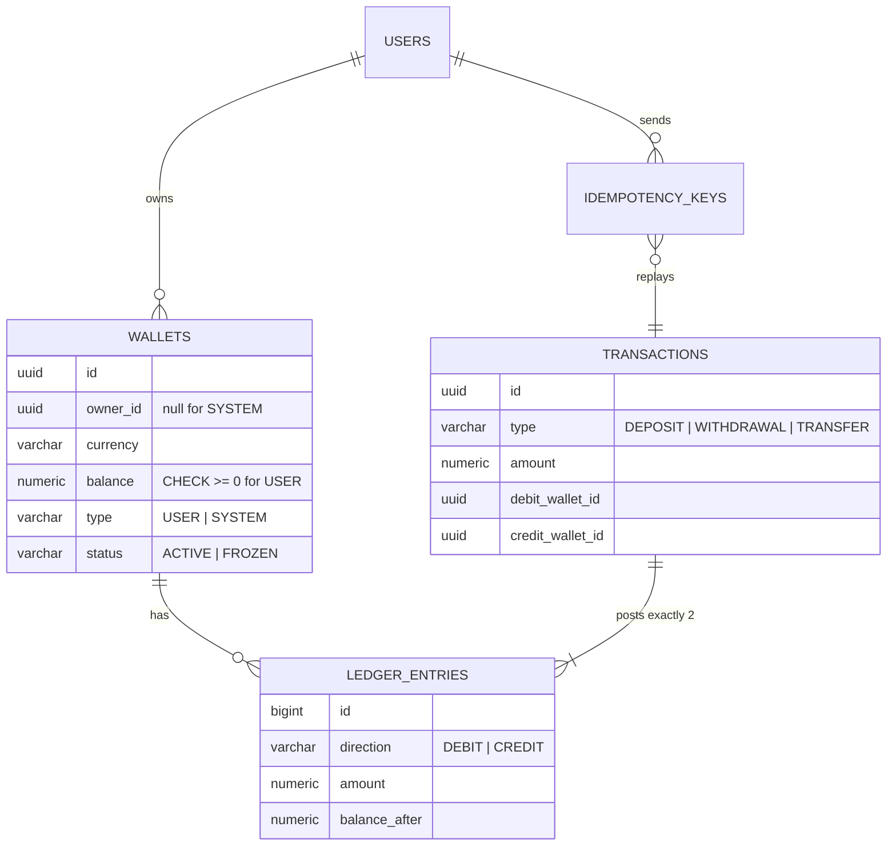

# Digital Wallet API

[](https://github.com/ebrahimmorkas/digital-wallet-api/actions/workflows/ci.yml)


A digital wallet and payments REST API built with **Java 21 and Spring Boot 3**. Users open wallets in several
currencies, top them up, withdraw, and send money to each other. Every movement is recorded in a
**double-entry ledger**.

The focus is on the parts that matter most in payments: **money is never created, lost or moved twice**, even
under concurrent requests and client retries. Tests against a real PostgreSQL database prove it.

---

## Highlights

| Problem | Solution |
|---|---|
| Money must never be created or lost | **Double-entry ledger**: every transaction writes one DEBIT and one CREDIT. A SYSTEM wallet per currency is the counter-account for deposits and withdrawals, so ledger entries always sum to zero per currency |
| Concurrent transfers corrupt balances | `SELECT … FOR UPDATE` on both wallets, **always locked in ascending id order**, which rules out deadlocks. Wallets are refreshed under the lock, so a balance check never reads stale state |
| Network retries cause double payments | **`Idempotency-Key` header** (Stripe-style) claimed with `INSERT … ON CONFLICT DO NOTHING` in the *same* DB transaction as the payment. Retries replay the original result, and reusing a key with a different body returns 422 |
| Overdrafts via race conditions | The balance check runs under the row lock, and a `CHECK (balance >= 0)` constraint backs it up in the database |
| Stateless, scalable auth | Spring Security **OAuth2 Resource Server** validating self-issued HS256 **JWTs** (issuer and expiry). BCrypt hashing. Login can't be used to discover which emails are registered |
| Consistent errors | [RFC 9457](https://www.rfc-editor.org/rfc/rfc9457) problem details everywhere, with machine-readable `code`s such as `INSUFFICIENT_FUNDS` |

### Proven by tests

```
TransferConcurrencyTest
  ✔ 200 opposing transfers (A→B and B→A at the same time on 16 threads): no deadlocks, exact balances
  ✔ 25 concurrent spends of 1.00 from a 10.00 wallet: exactly 10 succeed, balance ends at 0.00
  ✔ ledger sums to zero per currency, and every stored balance equals its ledger-derived balance
IdempotencyIntegrationTest
  ✔ 10 concurrent requests with the same Idempotency-Key produce exactly one transaction
```

## Architecture



### Data model



## API

| Method | Endpoint | Description |
|---|---|---|
| `POST` | `/api/auth/register` | Create an account |
| `POST` | `/api/auth/login` | Get a JWT access token |
| `GET` | `/api/users/me` | Current user's profile |
| `POST` | `/api/wallets` | Open a wallet (`USD`, `EUR`, `GBP`, `INR`) |
| `GET` | `/api/wallets` · `/api/wallets/{id}` | My wallets |
| `POST` | `/api/wallets/{id}/deposits` | Top up. Requires `Idempotency-Key` |
| `POST` | `/api/wallets/{id}/withdrawals` | Withdraw. Requires `Idempotency-Key` |
| `POST` | `/api/transfers` | Send money to another user. Requires `Idempotency-Key` |
| `GET` | `/api/wallets/{id}/transactions` | Statement: paginated, filterable by `type`, `direction`, `from`, `to` |
| `GET` `POST` | `/api/admin/wallets/{id}` · `/freeze` · `/unfreeze` | Admin only |

Interactive docs: **http://localhost:8080/swagger-ui.html** (click *Authorize* and paste the token)

## Getting started

```bash
docker compose up -d --build        # PostgreSQL + API on http://localhost:8080
./scripts/demo.sh                   # scripted walkthrough of the whole API
```

A bootstrap admin `admin@wallet.local` / `Admin12345` is created for the demo (override it with
`ADMIN_PASSWORD`).

### Walkthrough with curl

```bash
# Register and log in
curl -X POST localhost:8080/api/auth/register -H 'Content-Type: application/json' \
  -d '{"email":"alice@example.com","password":"Secret123","fullName":"Alice"}'
TOKEN=$(curl -s -X POST localhost:8080/api/auth/login -H 'Content-Type: application/json' \
  -d '{"email":"alice@example.com","password":"Secret123"}' | jq -r .accessToken)

# Open a USD wallet and top it up
WALLET=$(curl -s -X POST localhost:8080/api/wallets -H "Authorization: Bearer $TOKEN" \
  -H 'Content-Type: application/json' -d '{"currency":"USD"}' | jq -r .id)
curl -X POST localhost:8080/api/wallets/$WALLET/deposits -H "Authorization: Bearer $TOKEN" \
  -H "Idempotency-Key: $(uuidgen)" -H 'Content-Type: application/json' -d '{"amount":100.00}'

# Transfer (send the same request twice with the same key: the money moves once)
curl -X POST localhost:8080/api/transfers -H "Authorization: Bearer $TOKEN" \
  -H 'Idempotency-Key: order-42' -H 'Content-Type: application/json' \
  -d "{\"sourceWalletId\":\"$WALLET\",\"destinationWalletId\":\"<bob's wallet>\",\"amount\":25.00}"

# Statement
curl "localhost:8080/api/wallets/$WALLET/transactions?type=TRANSFER" -H "Authorization: Bearer $TOKEN"
```

### Run the tests

```bash
./mvnw verify    # needs Docker: integration tests use Testcontainers PostgreSQL
```

## Tech stack

Java 21 · Spring Boot 3.5 · Spring Security 6 (OAuth2 Resource Server, JWT) · Spring Data JPA (Specifications,
entity graphs, pessimistic locking) · PostgreSQL 16 · Flyway · springdoc-openapi · Lombok ·
JUnit 5 · Mockito · AssertJ · Testcontainers · Docker · GitHub Actions

## Project structure

```
src/main/java/com/ebrahimmorkas/wallet
├── auth/          # register, login, JWT issuing
├── user/          # user entity, profile endpoint
├── wallet/        # wallet aggregate (debit/credit/freeze rules)
├── ledger/        # LedgerService, transactions, entries, deposits/withdrawals, statements
├── transfer/      # peer-to-peer transfers
├── idempotency/   # Idempotency-Key handling + expiry job
├── admin/         # back-office freeze/unfreeze, bootstrap admin
├── config/        # security, OpenAPI, scheduling
└── common/        # exceptions + RFC 9457 error handler
```

## Design decisions

- **Pessimistic rather than optimistic locking for money movement.** Contention on a popular wallet (a merchant,
  say) would make optimistic retries thrash. Short row locks taken in a fixed order give predictable latency.
  `@Version` stays as a safety net.
- **The ledger is the source of truth and balances are a cache.** `balance_after` on every entry makes statements
  cheap, and a test asserts that stored balances always equal the balances derived from the ledger.
- **Idempotency lives in the database, not in memory or Redis.** Claiming the key in the same transaction as the
  payment makes "payment done but key not saved" (or the reverse) impossible.
- **Other users' wallets return 404, not 403,** so wallet ids can't be probed.

## Roadmap

- [ ] Refresh tokens and token revocation
- [ ] Currency exchange between a user's own wallets (FX rates plus a spread)
- [ ] Outbox events (`TransferCompleted`) for notifications and analytics
- [ ] Rate limiting on auth endpoints

## License

[MIT](LICENSE)
